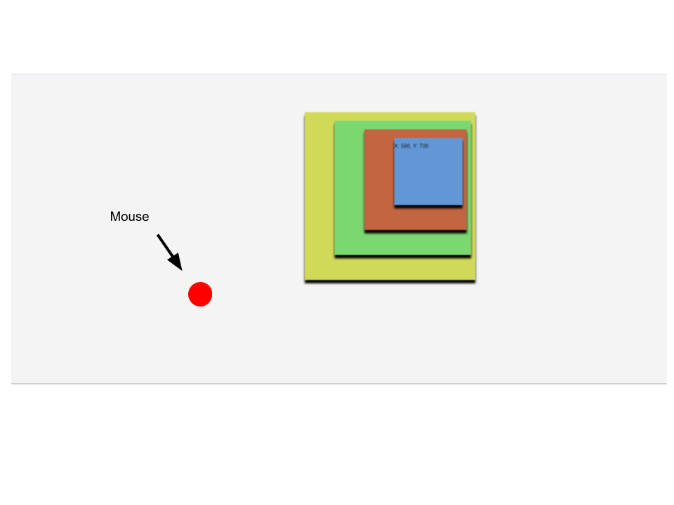

# Journal: Web Development Journey

---

## Entry 1: Switching Gears from Unity to Web Development

**Date**: [09/27/2023]

Today, I decided to pivot from creating a Unity-based server to developing an interactive website. The server interaction between Unity and Python was too slow, even when transferring data as binary files. So, I've opted for a more responsive web-based approach.

The first thing I did was create a simple website that can interact with mouse movements. Here are two images showing the webpage:

---

## Entry 2: Implementing Camera and Head Tracking

**Date**: [10/01/2023]

I took the next step by creating a website that can access the camera, locate my head, and return its position. Initially, I had the site return the head location as a string. However, I later decided to switch to a JSON file. This change should make data retrieval faster since parsing a JSON object is quicker than parsing a string.

---

## Entry 3: Parallax Site with Head Tracking

**Date**: [10/02/2023]

Today, I integrated the head tracking feature into a parallax website. The site's elements now move based on the location of my head. I encountered an issue where the coordinates from the camera didn't align with the screen coordinates. To fix this, I resized the frame that looks for a face before actually searching for it.

---